<div align="center">

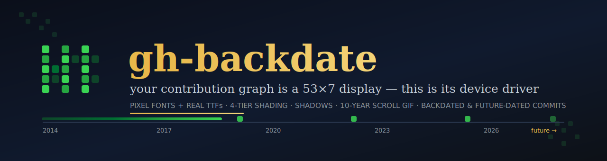

[](#-the-part-that-should-stop-you)
[](#-quickstart)
[](#-the-gallery-fonts-shadows-styles)
[](#-safety--undo)
[](LICENSE)
[](https://github.com/fire17/gh-backdate/stargazers)

<i>git lets you author a commit on any date that ever existed — or hasn't yet. That makes your contribution graph a display.</i>

**[⚡ Quickstart](#-quickstart)** · **[🤯 The stopper](#-the-part-that-should-stop-you)** · **[🎨 Gallery](#-the-gallery-fonts-shadows-styles)** · **[🧠 Learnings](#-learnings)** · **[🛟 Undo](#-safety--undo)**

</div>

---

## 🤯 The part that should stop you

**This repo's own commit history IS the artwork.** The decade-long marquee below was painted into *this* repository as backdated empty commits — and two of its cells are dated in the future.


- **611 weeks of tape, 1,260 lit cells, 2014-10-27 → 2026-07-08** — sized by the dry-run planner before a single commit existed (`python3 backdate.py --script --years 10` prints exactly those numbers).
- **2 of those cells hadn't happened yet at paint time** — git accepts future author dates and GitHub renders them; the current week's unlived days can already be green.
- **Every commit is `--allow-empty`** — zero file churn, fully counted by the graph. The paintbrush leaves no paint on the code.
- **It's completely reversible** — delete the repo and GitHub recalculates the graph. Art, not fraud (see [Safety](#-safety--undo)).
- **The grid math is verified, not vibed** — `gridmap.Grid(today)` derives all 53×7 cell dates from scratch each run; corner dates were checked by hand against a live profile (top-left `Sun 2025-07-06`, bottom-right `Sat 2026-07-11` for reference Monday 2026-07-06).

> [!IMPORTANT]
> **gh-backdate treats the contribution graph as a 53×7 display and gives you the device driver**: pixel fonts, real TTFs, 4-tier shading with drop-shadows, a decade-wide marquee tape, and one function that writes any text at any time window — past or future.

## 🗺️ How it works

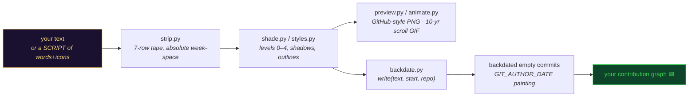

## ⚡ Quickstart

```bash
git clone https://github.com/fire17/gh-backdate && cd gh-backdate

python3 banner.py "Open Your Mind"                    # preview PNG, GitHub dark theme
python3 backdate.py "HELLO 2019" --start 2019-01-06   # dry-run plan: dates, cells, commits
python3 animate.py --years 10 --open                  # build + open the 10-year scroll GIF
```

Then paint for real (**dry-run is the default everywhere** — painting needs the explicit flag):

```bash
python3 backdate.py "HELLO 2019" --start 2019-01-06 --repo ~/path/to/repo --paint --intensity 9
python3 backdate.py --script --years 10 --repo ~/path/to/repo --paint --intensity 9   # the full parade
```

## 🧰 The toolkit

| Module | What it does |
|---|---|
| [`backdate.py`](backdate.py) | **The quick functions** — `write(text, start, repo)` / `write_script(years=10)` / `plan()`: anything, any window, past or future |
| [`gridmap.py`](gridmap.py) | date ↔ (col,row) for the 53×7 matrix; rows Sun(0)…Sat(6); always derived from `date.today()` |
| [`bitmapfont.py`](bitmapfont.py) | 5-tall variable-width pixel font (A–Z 0–9), auto-fits the 53-week width |
| [`glyphs7.py`](glyphs7.py) | 7-tall icons: smiley, heart, star, invader, alien, cat, ghost, robot… |
| [`strip.py`](strip.py) | the marquee tape: compose words + icons + gaps in absolute week-space |
| [`shade.py`](shade.py) / [`styles.py`](styles.py) | 4 GitHub green tiers (1/3/6/9 commits) · drop-shadow, outline, two-tone, twinkle |
| [`fonts.py`](fonts.py) / [`textrender.py`](textrender.py) / [`opencode_font.py`](opencode_font.py) | real TTFs (Bodoni, Baskerville, DIN, Times, Arial Narrow…) rasterized into the 7-row universe |
| [`preview.py`](preview.py) | pixel-faithful GitHub-style preview (rounded cells, month/day labels, Less→More legend) |
| [`animate.py`](animate.py) | slide a 53-week window across the tape → the scroll GIF |
| [`commitgen.py`](commitgen.py) | the low-level painter: level-aware backdated `--allow-empty` commits |
| [`gallery.py`](gallery.py) / [`build.py`](build.py) | regenerate every image in [`out/`](out/) |
| [`smallfonts.py`](smallfonts.py) | 4-tall + 3-tall micro fonts — stack TWO text lines in one 7-row window |
| [`modes.py`](modes.py) | canvas modes: `ghost "TEXT" -m 10` (temp text, detached auto-revert) · `starry --density N` (all-shade random noise) · `revert` — the default banner is always remembered |

## 🎨 The gallery (fonts, shadows, styles)

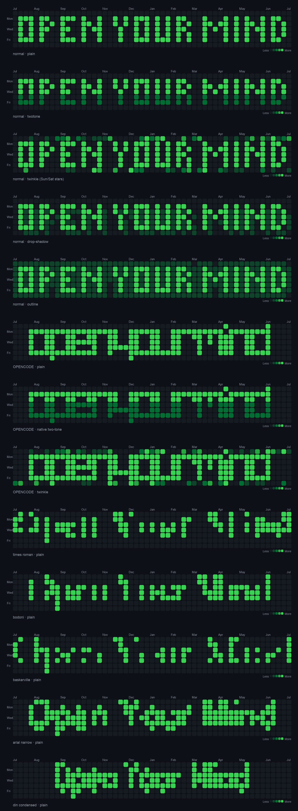

<details>
<summary><b>🔠 Font previews — pixel font vs real TTFs</b></summary>

| | |
|---|---|
| 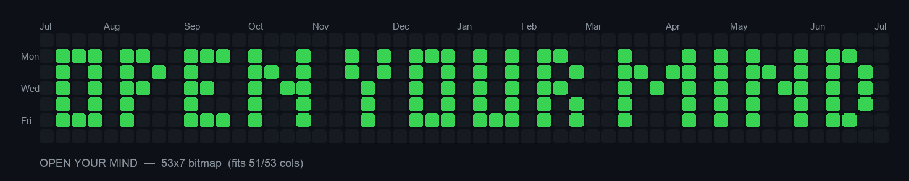 | 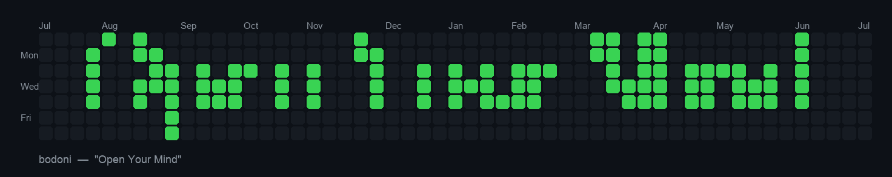 |
| 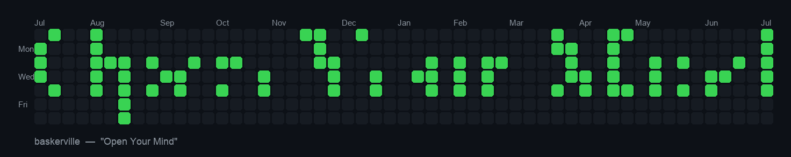 | 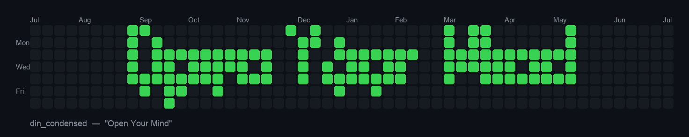 |
| 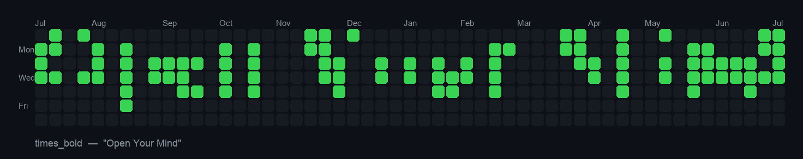 | 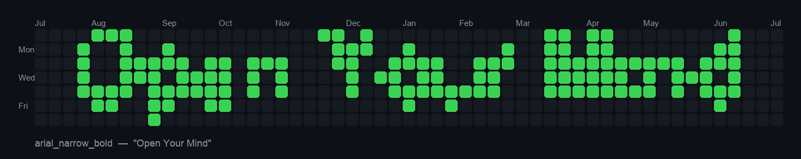 |
| 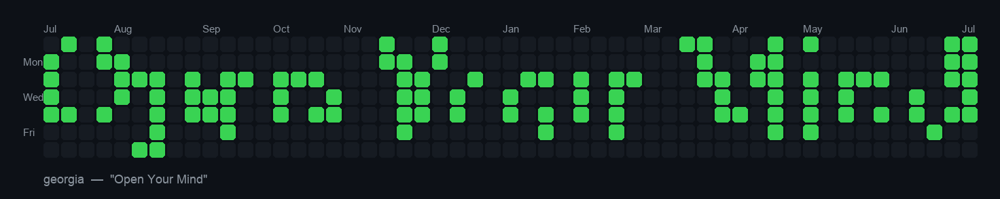 | 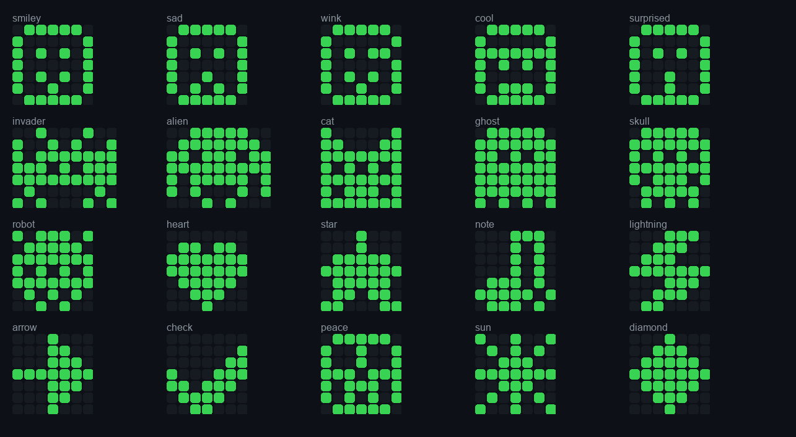 |

Full side-by-side: [`out/COMPARISON.png`](out/COMPARISON.png)
</details>

<details>
<summary><b>🌗 Shading & shadow styles — multigradient on/off, drop-shadow, outline, flat</b></summary>

| | |
|---|---|
| 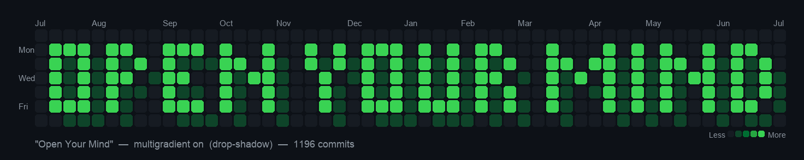 | 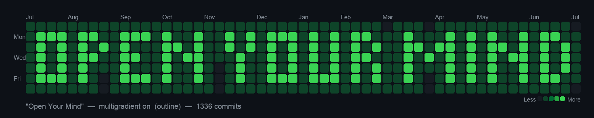 |
|  | 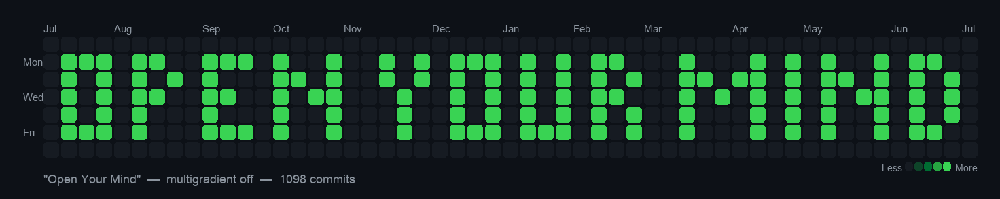 |

Levels → commits/day → GitHub tier: `1→1 #0e4429` · `2→3 #006d32` · `3→6 #26a641` · `4→9 #39d353`. Tiers are **relative to your busiest day** — paint with `--intensity 9` on an active account to guarantee the brightest green.
</details>

<details>
<summary><b>🎞️ The 10-year scroll — frames & samples</b></summary>

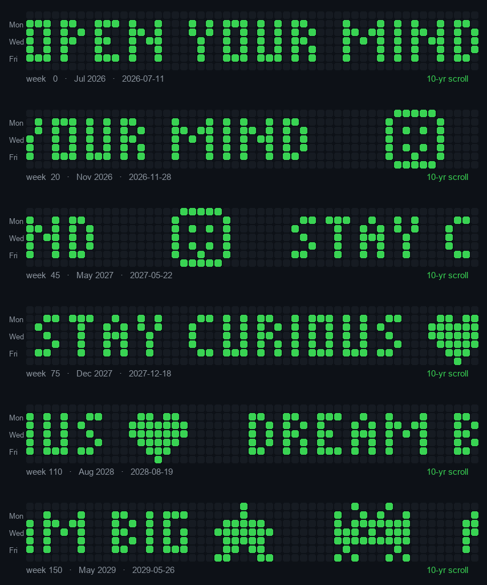

The default parade (`strip.SCRIPT`): *OPEN YOUR MIND · STAY CURIOUS · DREAM BIG · 👾 · HELLO WORLD · BE KIND · THE FUTURE IS NOW · KEEP GOING · MADE WITH ♥* — edit the token list and rebuild.
</details>

## 🏗️ How this was built

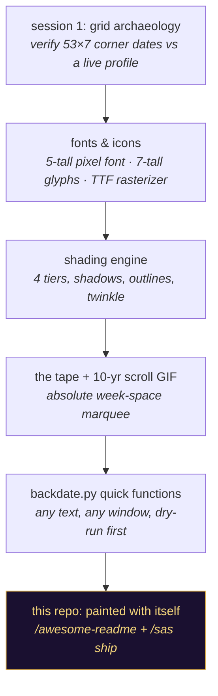

Built in Claude Code sessions on 2026-07-06, steered by fire17's doctrine skills. **Defects the process caught** (kept, proudly): hand-retyping box output corrupted borders twice → replaced by self-asserting renderers; a top-border off-by-one survived three "looks fine" reviews until a width assertion refused to print it; `▶️`-class characters (narrow + U+FE0F) forced a sequence-aware width function. The same discipline runs here: `backdate.py` prints its full plan before any commit exists. Full harvest: [LEARNINGS.md](LEARNINGS.md).

## 🧠 Learnings

The 13 verified lessons live in [**LEARNINGS.md**](LEARNINGS.md) — graph mechanics (empty commits count; future dates render; shading is relative; contributions need a verified email + default branch), typography in a 7-row universe, and the process laws (dry-run by default, recompute from today, verbatim beats retyping).

## 🛟 Safety & undo

| Concern | Answer |
|---|---|
| Does painting touch my files? | **Never.** Only `--allow-empty` commits — zero file churn. |
| Can I preview before committing? | Always — **dry-run is the default**; painting requires `--paint` plus an explicit `--repo`. |
| How do I undo the art? | Delete the repo (or the painted branch) — GitHub recalculates the graph. |
| Is this deceptive? | It's your own graph, on a repo anyone can open and see is empty-commit art. Don't use it to fake work history — use it to say hi. |
| Where should I paint? | A dedicated repo (like this one) — or a throwaway account for a clean canvas where every lit day auto-maxes the shade. |

## 🤝 Trust

Every number in this README is observed output, not copywriting: the dry-run planner prints the tape/cell/commit counts you see above; the grid corners were hand-checked against a rendered profile; the gallery images are generated by [`gallery.py`](gallery.py) from the same code that paints. Clone it and run the three quickstart lines — the receipts reproduce.

## ⭐ If this made you grin

This repo's thesis is that even a commit log can be a canvas. If it opened your mind a pixel — **star it, and the banner becomes true on your screen too** (the tape's first words are the instructions).

[](https://star-history.com/#fire17/gh-backdate&Date)

Siblings from the same workshop: [fable-masterclass](https://github.com/fire17/fable-masterclass) — a frontier model's self-distillation, README'd by the same playbook.

## 📄 License

[MIT](LICENSE) — paint responsibly.

---

<div align="center">
<sub><i>611 weeks · 1,260 cells · one repo that is its own artwork — made with 🟩 by fire17 & Claude</i></sub>
</div>
